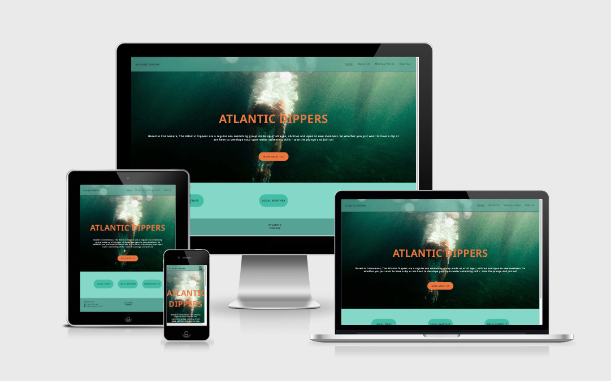
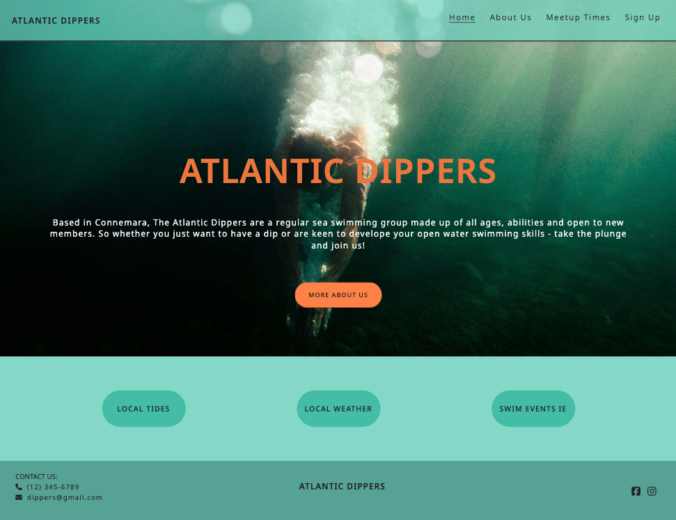
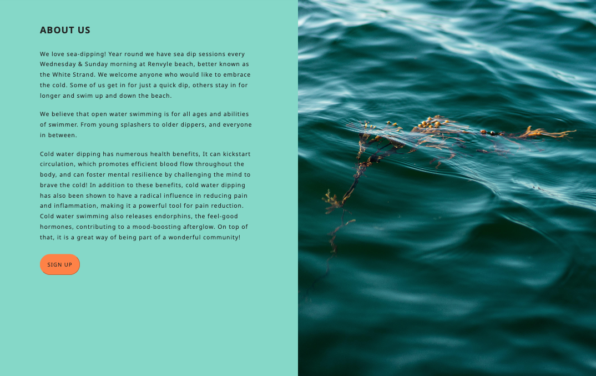

# ATLANTIC DIPPERS



[View Live Website here.](https://lemmenaid.github.io/atlantic-dippers/)

[GitHub Repo](https://github.com/LemmenAid/atlantic-dippers)

*** 

## Project Description  

_Atlantic Dippers is a fictional swim club created for my first portfolio project with [Code Institute](https://codeinstitute.net/ie/)._

Atlantic Dippers is a website that hopes to enthuse people about cold water dipping.
The site is targeted towards people who live in the area of Connemara and are looking for a group to go sea dipping with. The site will be useful for everyone who would like to know more about the Atlantic Dippers and would like to join a local dip swim club. The website provides all the necessary information about where and when the swim group meets. It also provides some useful links to external websites for information about local tides and weather information. 

## Project Purpose

To unite cold water dippers in the area of Renvyle, Connemara. Cold water dipping has many benefits, but it can be hard to keep it up regularly on your own. Having a group to go dip swimming with will help with keep showing up and it creates a great way for socializing with other dippers.

***

## Index – Table of Contents

* [User Experience (UX)](#user-experience) 
* [Design](#design)
* [Features](#features)
* [Technologies Used](#technologies-used)
* [Testing](#testing)
* [Known Bugs](#known-bugs)
* [Deployment](#deployment)
* [Credits](#credit)

***

## User Experience (UX)

### User Stories

1. As a first time user, I want to easily understand the main purpose of the site. 
2. As a new user, I want to easily navigate the site, so I can find what I need efficiently. 
3. As an interested user I want to be able to learn more about the Ataltic Dippers club.
4. As an interested user who has decided to join the club I want it to be easy to sign up. 
5. As a returning user, I want to easily find information about when and where the club meets.
6. As a returning user, I want easy access to the links I might use for info on weather/tides/events.
7. As a user I want to be able to contact the club for any further questions.

***

## Design

### Colour Scheme


* The colour scheme is inspired by the water colour of the sea in Connemara. The Cyan colour is used in different shades for the main background, header and footer. The light orange is added for it’s complementairy quality for buttons and titles. The darker orange is used for the hover css effect.
* The background colour of the site is kept in a lighter shade of Cyan than the header and footer, for better readability. For good Accessibility the text colour is kept dark. 
* Connemara has a rich Cyan ocean colour and this colour comes back in all the images. Where text is used over an image the colour light orange is used for the font, this is done for better Accessibility. 

### Typography

* The typography used throughout the site is Noto Sans, imported from google fonts. Noto Sans was chosen because of it’s readability in various sizes and clean design. As a fallback font sans serif is used. I have increased the letter spacing to increase readability in the paragraphs. I have used slightly more letter spacing for headings to make them stand out more. I have used different font weights for the headings to make them stand out more as well.

I imported the following code into the top of my style.css

    @import url(‘https://fonts.googleapis.com/css2?family=Noto+Sans:ital,wght@0,100..900;1,100..900&family=Noto+Serif:ital,wght@0,100..900;1,100..900&display=swap');

<br>

### Call to Action

* The call to action button on the landing page leads to the About Us page. On the About Us page there is a call to action button that leads to the Signup Page. This way visitors read more about the swim club before being lead to the Signup Page, for an informed and easy navigation throughout the website.
* All the buttons on the website are styled with a colour change so that it is clear for any visitor that these are buttons.
* The social media links will send the visitor to the company’s social media pages. The links will open in a new tab.
* The links in the footer for the “Contact Us” section are highlighted with an underline when the mouse hoovers over them, so that it is clear to the visitor that these are links.

### Imagery

Because this website is concept based, I had no real images of this Swimclub I could use. Therefor I tried to find images that match the colour scheme and theme of the website. I used Pexels as a free images source.

Links to Pexels images:

* [Landing page image](https://www.pexels.com/photo/man-in-black-shorts-swimming-in-water-9500557/)
* [Meetup page image](https://www.pexels.com/photo/men-diving-swimming-underwater-6181960/)
* [Signup page image](https://www.pexels.com/photo/group-of-people-swimming-on-beach-1249545/)

* The About Us page image was a photo taken by me.


### Layout / Wireframes

* I made the basic design layout of the website designing wireframes with Balsamiq. 
* I have used responsive design for creating this website. For instance, when a page goes from mobile to larger screens some of the content goes from stacked to lined up.
* Using padding and margin to make sure that the content is spaced out and easy to read.

#### Home Page
<br>

#### About Us Page
<br>

#### Meetup Page
<br>

#### Signup Page
<br>

#### Mobile View
<br>

***

## Features

### General Features on each page

#### Navigation Bar

* Featured on all three pages, the full responsive navigation bar includes links to the Logo/landing page, about us, meetup times and Sign Up page and is identical in each page to allow for easy navigation.
* This section will allow the user to easily navigate from page to page across all devices without having to revert back to the previous page via the ‘back’ button. 


#### The Footer

  * Featured on all three pages, the footer section includes the contact information of the club.
  * The footer section includes links to the relevant social media sites for Atlantic Dippers. The links will open to a new tab to allow easy navigation for the user. 


### Features by page

#### Landing Page

* The landing page introduces the user to Atlantic Dippers with an eye catching photograph to grab their attention.
* This page includes a call to action button that leads to the “About Us” which allows users to easily find more information about the club. 
* The landing page also has three buttons to external links that are useful for members of the club. They are on the landing page so frequent users are just one click away from this information, like the local tides, local weather and national swimming events.



#### About Page

* The about page includes a brief outline of what the club is all about.
* This page also includes some information about the benefits of cold water dipping and swimming.
* A call to action button is added to the bottom of the page which leads visitors to the Signup page.



#### Meetup Times Page

* This page informs the user about when the meetups will happen and where they will be located.
* Included on this page is a google map that was embedded via Google Maps with the exact location where the Atlantic Dippers meet up.


#### Sign Up Page

* This page will allow the user to get signed up to the Atlantic Dippers to start their dipping journey with their local community. The user will be asked what level of previous experience they have with open water swimming. The user will be asked to submit their full name and email address. 


### Future Implementations

* Because the colour palette features several times throughout the website I would’ve liked to  have set a variable in the code for this, so it would be easier to change the palette if necessary.
* A page about water safety.
* A dedicated contact page.

*** 

## Technologies Used

* HTML5 - Mark-up language using semantic structure.
* CCS3 - Cascading stylesheet used to style the website.
* Gitpod.io - For writing the code. Using the command line for committing and pushing to Git Hub
* GitHub - Used to host repository 

### Design
* Noto Sans Font from [Google Fonts](https://fonts.google.com/) 
* Icons from [Font Awesome](https://fontawesome.com/)
* Favicon [Favicon](https://favicon.io)
* Wireframes [Balsamiq wireframe](https://balsamiq.com/)
* Google maps embed from Google inc. [Google Maps](https://www.google.com/maps)
* Images from [Pexels](https://www.pexels.com/)
* Colour palette generator [Coolors](https://coolors.co/)

### Testing
* Testing validity of HTML with [Validator](https://validator.w3.org/) 
* Testing validity of CSS with [CSS Validator](https://validator.w3.org/)
* Checking responsive nature with [UI](https://ui.dev/amiresponsive?\)
* Testing performance andaccessibility with DEV Tools - Lighthouse

***

## Testing

### Browser Compatibility

The website has been tested for functionality by myself and several of my friends.
It has been tested on an iPhone SE / iPhone 12 / iPhone 14 / Samsung Galaxy S9 / Samsung Galaxy S20 / MacBook Air / MacBook Pro / HP laptop.
The website has been tested in the following browsers: Chrome / Safari / Firefox / Microsoft Edge.
All links/buttons have been tested for functionality.
Hover over effects have been tested.
Signup Form has been tested for functionality and feedback.
Social media Icons have been tested.

### Responsivness

The website has been tested on different screensizes and it's responsive on all screens from mobile phones to desktops.
Chrome DEV Tools have been used to check the responsivness.


### Validator Testing

#### HTML
The [W3C](https://validator.w3.org/) Markup Validator was used to validate every page of the project to check that there were no syntax errors made in the HTML code.

There was one error returned about an inline style attribute:


I removed the inline style attribute and soved it with CSS. After that no errors were returned for any of the pages.


#### CSS
The [Jigsaw](https://jigsaw.w3.org/css-validator/validator) CSS Validator Services was used to validate the CSS code to make sure that there were no syntax errors made in the project.

Two value errors were returned:


After fixing that, no errors were returned, but there were still a few warnings displayed about using the same colour for a background and border, but I have done that intentional, so I am happy with the outcome.


### Lighthouse

After validator testing I have used Chrome’s Lighthouse developer tool to check all pages. 

#### Landing Page


#### About Us Page


#### Meetup Page


#### Signup Page


***

## Known Bugs

* During testing for Accessibility I realised that the background colour had to be changed for better readability. I changed it to a lighter hue and that was an improvement.
* During testing, I got the feedback that some of my font sizes were too small. I increased the font size in a lot of places, like the header, footer but also main content.
* During testing I changed the colour from orange to black for the titles in my main content, this made it a lot more readable.

***

## Deployment

I have taken the following from the Sample README from Code Institute for this deployment section.

### GitHub Pages

The project was deployed to GitHub Pages using the following steps...

1. Log in to GitHub and locate the [GitHub Repository](https://github.com/)
2. At the top of the Repository (not top of page), locate the "Settings" Button on the menu.
    - Alternatively Click [Here](https://raw.githubusercontent.com/) for a GIF demonstrating the process starting from Step 2.
3. Scroll down the Settings page until you locate the "GitHub Pages" Section.
4. Under "Source", click the dropdown called "None" and select "Master Branch".
5. The page will automatically refresh.
6. Scroll back down through the page to locate the now published site [link](https://github.com) in the "GitHub Pages" section.

### Forking

By forking the GitHub Repository we make a copy of the original repository on our GitHub account to view and/or make changes without affecting the original repository by using the following steps...

1. Log in to GitHub and locate the [GitHub Repository](https://github.com/)
2. At the top of the Repository (not top of page) just above the "Settings" Button on the menu, locate the "Fork" Button.
3. You should now have a copy of the original repository in your GitHub account.

### Making a Local Clone

1. Log in to GitHub and locate the [GitHub Repository](https://github.com/)
2. Under the repository name, click "Clone or download".
3. To clone the repository using HTTPS, under "Clone with HTTPS", copy the link.
4. Open Git Bash
5. Change the current working directory to the location where you want the cloned directory to be made.
6. Type `git clone`, and then paste the URL you copied in Step 3.

```
$ git clone https://github.com/YOUR-USERNAME/YOUR-REPOSITORY
```

7. Press Enter. Your local clone will be created.

```
$ git clone https://github.com/YOUR-USERNAME/YOUR-REPOSITORY
> Cloning into `CI-Clone`...
> remote: Counting objects: 10, done.
> remote: Compressing objects: 100% (8/8), done.
> remove: Total 10 (delta 1), reused 10 (delta 1)
> Unpacking objects: 100% (10/10), done.
```

***

## Credits

* I would like to thank Brian Macharia for his great mentor support and guidance - helping me through the process of building my first ever website.
* My facilitator Amy from Code Institute for supporting us through our first project and giving us great tips and resources for learning tools, and her feedback during the weekly stand-ups.
* Tutor support at Code Institute for their support when I got stuck with CodeAnywhere (and changed over to GitPod).
* At last I would like to give thanks to my friends for taking the time to test the website and giving me great feedback.

### Content

Idea and content are developed by myself. 

For the text about the health benefits of cold water dipping I have used several sources:
* [Healtline](https://www.healthline.com/health/cold-water-therapy)
* [Everyday Health](https://www.everydayhealth.com/wellness/possible-health-benefits-to-cold-water-therapy/)
* [Harpers Bazaar](https://www.harpersbazaar.com/beauty/health/a43116150/best-cold-plunge-benefits/)

I have taken inspiration from the following swim club websites for the layout and some of the text:
* [Wexford Masters Seaswimming Club](https://wexmseaswim.com/)
* [Lancing Sea Swimmers](https://lancingsc.org.uk/sea-swimmers/)
* [Outdoor Swimming Society](https://www.outdoorswimmingsociety.com/elsewhere/)

I have used the following external links on the website: 
* Local tides link [Tides Chart](https://www.tideschart.com/Ireland/Connaught/County-Galway/Cleggan-Bay/)
* Local weather link [YR](https://www.yr.no/en/details/table/2-7838925/Ireland/Connacht/County%20Galway/Renvyle)
* Swim events link [Get Outdoors](https://www.getoutdoors.ie/swim-events)

### Media

All but one images are taken from Pexels, a free source:

* About Us page image was a photo taken by me.
* [Landing page image](https://www.pexels.com/photo/man-in-black-shorts-swimming-in-water-9500557/)
* [Meetup page image](https://www.pexels.com/photo/men-diving-swimming-underwater-6181960/)
* [Signup page image](https://www.pexels.com/photo/group-of-people-swimming-on-beach-1249545/)


### Code

To get started I initially took a lot of the code from the “Love Running” walktrough project. A few things I left almost exactly the same, like the Asterisk wildcard selector, the Contact us page and the Header & Navigation. But for a big part I went with a completely different layout and this challanged me to figure out how to get the website to look the way I had designed. I have used various resources to help me with this:

* Code Institute Slack Channel
* [Stack overflow](https://stackoverflow.com/)
* [CSS Tricks](https://css-tricks.com)
* [Emmet](https://docs.emmet.io/cheat-sheet/)
* [W3Schools](https://www.w3schools.com/)

#### Templates I have used for inspiration and creating my readme-file:

* [Sample README Code Institute](https://github.com/Code-Institute-Solutions/SampleREADME/blob/master/README.md?plain=1) - Copied the Deployment section and used for general guidance.
* [Read Me Template Code Institute](https://github.com/Code-Institute-Solutions/readme-template/blob/master/README.md)
Used for general guidance.
* [Plant Factory - crypticCaroline](https://github.com/crypticCaroline/ms1-plantfactory/blob/master/README.md?plain=1) - Especially for the Technologies Used, Testing sections and design sections.
* [Visit Järbo - ClaudiaInSweden](https://github.com/ClaudiaInSweden/visit-jarbo/blob/main/README.md?plain=1) - General inspiration and guidance.
* [Mountain Magic Accomodation - Adrianskelton](https://github.com/Code-Institute-Submissions/Projecto1/blob/main/README.md) - Layout and general inspiration.
* [GitHub Docs](https://docs.github.com/en)

